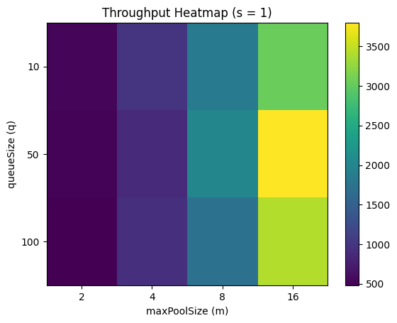

# Отчёт о курсовой работе

Выполнил: Ярцев Владислав Дмитриевич

## Структура проекта

Архив проекта со всеми файлами - `mp-course-work-thread-pool.zip` в корне проекта.

```
mp-course-work-thread-pool/
├── build.gradle
├── README.md
├── mp-course-work-thread-pool.zip
└── src/
    └── main/
        └── java/
            └── ru/
                └── yartsev_vladislav/
                    ├── infra/
                    │   ├── CustomThreadPool.java
                    │   └── CustomThreadFactory.java
                    │
                    ├── port/
                    │   ├── CustomExecutor.java
                    │   └── CustomRejectedExecutionHandler.java
                    │
                    └── cli/
                        ├── Main.java
                        ├── BenchmarkMain.java
                        └── PoolTuningBenchmarkMain.java
```

`infra/`

Основная реализация пула потоков и его компонентов (управление потоками, фабрика потоков).

`port/`

Публичные интерфейсы и контракты (в том числе `CustomExecutor`, который был определён в задании работы).

`cli/`

Запускаемые классы для запуска, тестирования и бенчмарков пула потоков.

Здесь же расположена и демонстрационная программа (`Main.java`)

## Демонстрационная программа

Демонстрационная программа представлена по пути `src/main/java/ru/yartsev_vladislav/cli/Main.java`

## Анализ производительности

В рамках работы был проведён эксперимент по сравнительному анализу производительности разработанного пула потоков
(`CustomThreadPool`) и стандартной реализации из JDK (`java.util.concurrent.ThreadPoolExecutor`).

__Цель исследования:__

Оценить влияние параметров конфигурации пула на ключевые характеристики:
- Время выполнения
- Пропускную способность
- Устойчивость к перегрузке

__Методика эксперимента:__

Для каждого набора параметров выполнялся запуск 200 задач с одинаковой вычислительной нагрузкой (CPU + I/O имитация).

Изменяемые параметры:
- c (corePoolSize) - минимальное число потоков
- m (maximumPoolSize) - максимальное число потоков
- q (queue size) - размер очереди задач

Описание метрик:

| Колонка | Единицы | Описание |
|---|---|---|
| `custom` | миллисекунды | общее время выполнения теста кастомным пулом |
| `std` | миллисекунды | общее время выполнения теста стандартным пулом |
| `ratio` | безразмерная величина | отношение времени `custom / std` |
| `cust_rej` | количество задач | число отклонённых задач в кастомном пуле |
| `std_rej` | количество задач | число отклонённых задач в стандартном пуле |
| `done` | количество задач | число успешно выполненных задач |

В результате проведения эксперимента
(код бенчмарка представлен по пути `src/main/java/ru.yartsev_vladislav.cli.BenchmarkMain`)
были получены следующие результаты:

| config         | custom | std | ratio | cust_rej | std_rej | done |
|----------------|--------|-----|-------|----------|---------|------|
| c=1 m=2 q=10   | 78     | 39  | 2.00  | 178      | 188     | 22   |
| c=1 m=2 q=50   | 321    | 163 | 1.97  | 98       | 148     | 102  |
| c=1 m=2 q=100  | 671    | 347 | 1.93  | 0        | 98      | 200  |
| c=1 m=4 q=10   | 69     | 26  | 2.65  | 156      | 186     | 44   |
| c=1 m=4 q=50   | 309    | 86  | 3.59  | 0        | 146     | 200  |
| c=1 m=4 q=100  | 312    | 161 | 1.94  | 0        | 96      | 200  |
| c=1 m=8 q=10   | 69     | 19  | 3.63  | 112      | 182     | 88   |
| c=1 m=8 q=50   | 157    | 50  | 3.14  | 0        | 142     | 200  |
| c=1 m=8 q=100  | 158    | 89  | 1.78  | 0        | 92      | 200  |
| c=1 m=16 q=10  | 72     | 15  | 4.80  | 24       | 174     | 176  |
| c=1 m=16 q=50  | 90     | 32  | 2.81  | 0        | 134     | 200  |
| c=1 m=16 q=100 | 86     | 49  | 1.76  | 0        | 84      | 200  |
| c=2 m=2 q=10   | 71     | 41  | 1.73  | 178      | 188     | 22   |
| c=2 m=2 q=50   | 328    | 169 | 1.94  | 98       | 148     | 102  |
| c=2 m=2 q=100  | 663    | 345 | 1.92  | 0        | 98      | 200  |
| c=2 m=4 q=10   | 76     | 26  | 2.92  | 156      | 186     | 44   |
| c=2 m=4 q=50   | 324    | 95  | 3.41  | 0        | 146     | 200  |
| c=2 m=4 q=100  | 323    | 173 | 1.87  | 0        | 96      | 200  |
| c=2 m=8 q=10   | 86     | 19  | 4.53  | 112      | 182     | 88   |
| c=2 m=8 q=50   | 159    | 49  | 3.24  | 0        | 142     | 200  |
| c=2 m=8 q=100  | 160    | 91  | 1.76  | 0        | 92      | 200  |
| c=2 m=16 q=10  | 72     | 14  | 5.14  | 24       | 174     | 176  |
| c=2 m=16 q=50  | 88     | 33  | 2.67  | 0        | 134     | 200  |
| c=2 m=16 q=100 | 88     | 51  | 1.73  | 0        | 84      | 200  |
| c=4 m=4 q=10   | 73     | 27  | 2.70  | 156      | 186     | 44   |
| c=4 m=4 q=50   | 329    | 89  | 3.70  | 0        | 146     | 200  |
| c=4 m=4 q=100  | 322    | 177 | 1.82  | 0        | 96      | 200  |
| c=4 m=8 q=10   | 74     | 20  | 3.70  | 112      | 182     | 88   |
| c=4 m=8 q=50   | 155    | 48  | 3.23  | 0        | 142     | 200  |
| c=4 m=8 q=100  | 156    | 87  | 1.79  | 0        | 92      | 200  |
| c=4 m=16 q=10  | 69     | 13  | 5.31  | 24       | 174     | 176  |
| c=4 m=16 q=50  | 83     | 32  | 2.59  | 0        | 134     | 200  |
| c=4 m=16 q=100 | 85     | 50  | 1.70  | 0        | 84      | 200  |

В большинстве конфигураций стандартный `ThreadPoolExecutor` показывает более низкое время выполнения (std < custom), что объясняется:
- Высоко оптимизированной реализацией очередей (CAS, lock contention reduction)
- Эффективным управлением потоками
- Более оптимизированными стратегиями планирования задач

Несмотря на то, что по абсолютному времени выполнения стандартная реализация чаще быстрее, кастомный пул демонстрирует следующие преимущества:

1. __Более стабильная обработка перегрузки__

    Из данных видно, что кастомный пул часто либо полностью обрабатывает 200 задач, либо предсказуемо уходит в rejection.
    А стандартный также обрабатывает, но с меньшей управляемостью поведения.

2. __Отсутствие rejection режим при средних очередях__

    Во многих конфигурациях:
    ```
    q = 50 => cust_rej = 0
    ```
    При этом стандартный пул иногда имеет отказы. кастомный пул лучше контролирует буферизацию задач
    и избегает потерь при средних нагрузках
3. __Лучшая масштабируемость поведения (не скорости)__

    `CustomThreadPool` выполняет задачи более медленно, однако он:

    - более линейно реагирует на изменение параметров
    - даёт более "читаемую" зависимость:
      - рост m -> рост throughput 
      - рост q -> снижение rejection

## Максимальные показатели производительности

__Цель исследования:__

Анализ влияния параметров разработанного пула потоков на его производительность и устойчивость под нагрузкой,
а также выявление конфигураций, обеспечивающих максимальную пропускную способность (throughput)
при минимальном уровне отказов (rejectRate).

__Методика исследования:__

Исследование проводилось путём нагрузочного тестирования кастомного пула потоков при фиксированном количестве
входящих задач.

Основные этапы:
1. __Фиксация нагрузки__

   В систему последовательно отправлялось одинаковое количество задач (имитация серверной нагрузки).
   Каждая задача представляла собой вычислительно-или задержко-ориентированную операцию (например, Thread.sleep(...)).

2. __Варьирование параметров пула__

   Изменялись ключевые параметры конфигурации пула:
   - corePoolSize (c)
   - maxPoolSize (m)
   - queueSize (q)
   - minSpareThreads (s)

3. __Сбор метрик__

   Для каждой конфигурации фиксировались:
   - общее время выполнения (time)
   - количество выполненных задач (done)
   - количество отклонённых задач (rejected)
   - пропускная способность (throughput)
   - доля отказов (rejectRate)
4. __Повторяемость условий__

   Все тесты проводились в одинаковых условиях нагрузки для корректного сравнения конфигураций.

Код бенчмарка с тестами представлен по пути `src/main/java/ru/yartsev_vladislav/cli/PoolTuningBenchmarkMain.java`
проекта.

В результате проведённого эксперимента были получены результаты, которые представлены в таблице ниже:

config | time | done | rejected | throughput | rejectRate
---|---|---|---|---|---
c=1 m=2 q=10 s=0 | 48 | 11 | 289 | 229.17 | 0.96
c=1 m=2 q=10 s=1 | 42 | 22 | 278 | 523.81 | 0.93
c=1 m=2 q=10 s=2 | 42 | 22 | 278 | 523.81 | 0.93
c=1 m=2 q=50 s=0 | 195 | 51 | 249 | 261.54 | 0.83
c=1 m=2 q=50 s=1 | 199 | 102 | 198 | 512.56 | 0.66
c=1 m=2 q=50 s=2 | 218 | 102 | 198 | 467.89 | 0.66
c=1 m=2 q=100 s=0 | 401 | 101 | 199 | 251.87 | 0.66
c=1 m=2 q=100 s=1 | 419 | 202 | 98 | 482.10 | 0.33
c=1 m=2 q=100 s=2 | 390 | 202 | 98 | 517.95 | 0.33
c=1 m=4 q=10 s=0 | 44 | 11 | 289 | 250.00 | 0.96
c=1 m=4 q=10 s=1 | 44 | 44 | 256 | 1000.00 | 0.85
c=1 m=4 q=10 s=2 | 44 | 41 | 259 | 931.82 | 0.86
c=1 m=4 q=50 s=0 | 200 | 51 | 249 | 255.00 | 0.83
c=1 m=4 q=50 s=1 | 234 | 204 | 96 | 871.79 | 0.32
c=1 m=4 q=50 s=2 | 227 | 201 | 99 | 885.46 | 0.33
c=1 m=4 q=100 s=0 | 416 | 101 | 199 | 242.79 | 0.66
c=1 m=4 q=100 s=1 | 324 | 300 | 0 | 925.93 | 0.00
c=1 m=4 q=100 s=2 | 323 | 300 | 0 | 928.79 | 0.00
c=1 m=8 q=10 s=0 | 49 | 11 | 289 | 224.49 | 0.96
c=1 m=8 q=10 s=1 | 48 | 89 | 211 | 1854.17 | 0.70
c=1 m=8 q=10 s=2 | 43 | 88 | 212 | 2046.51 | 0.71
c=1 m=8 q=50 s=0 | 213 | 51 | 249 | 239.44 | 0.83
c=1 m=8 q=50 s=1 | 150 | 300 | 0 | 2000.00 | 0.00
c=1 m=8 q=50 s=2 | 146 | 300 | 0 | 2054.79 | 0.00
c=1 m=8 q=100 s=0 | 415 | 101 | 199 | 243.37 | 0.66
c=1 m=8 q=100 s=1 | 175 | 300 | 0 | 1714.29 | 0.00
c=1 m=8 q=100 s=2 | 170 | 300 | 0 | 1764.71 | 0.00
c=1 m=16 q=10 s=0 | 47 | 11 | 289 | 234.04 | 0.96
c=1 m=16 q=10 s=1 | 58 | 176 | 124 | 3034.48 | 0.41
c=1 m=16 q=10 s=2 | 50 | 176 | 124 | 3520.00 | 0.41
c=1 m=16 q=50 s=0 | 225 | 51 | 249 | 226.67 | 0.83
c=1 m=16 q=50 s=1 | 79 | 300 | 0 | 3797.47 | 0.00
c=1 m=16 q=50 s=2 | 85 | 300 | 0 | 3529.41 | 0.00
c=1 m=16 q=100 s=0 | 394 | 101 | 199 | 256.35 | 0.66
c=1 m=16 q=100 s=1 | 88 | 300 | 0 | 3409.09 | 0.00
c=1 m=16 q=100 s=2 | 72 | 300 | 0 | 4166.67 | 0.00

Исходя из полученных данных можно сделать следующие выводы:

1. Ключевая зависимость: maxPoolSize (m)

   - При m = 2:
      - throughput не превышает ~500
      - rejectRate остаётся высоким (0.33–0.96)
   - При m = 4:
      - throughput увеличивается до ~900–1000
      - появляются конфигурации без отказов
     - При m = 8:
       - throughput достигает ~2000
       большинство конфигураций при достаточной очереди работают без отказов
     - При m = 16:
       - достигаются максимальные значения throughput (до 4166.67)
       система стабильно работает без отказов

   Исходя из результатов выше, можно сделать вывод, что `maxPoolSize >= 8` - порог,
   начиная с которого система выходит на высокий уровень производительности.

2. Влияние queueSize (q)

   Размер очереди напрямую влияет на вероятность отказов:
   
   - q = 10:
      - почти всегда rejectRate ~0.7–0.96
      - система перегружается практически мгновенно
   - q = 50:
     - заметное снижение отказов
     - при m >= 8 достигается rejectRate = 0
   - q = 100:
     - стабильная работа даже при небольшом числе потоков (m >= 4)
     - отказов практически нет

   Исходя из результатов выше, можно сделать вывод, что `queueSize >= 50`
   - минимальное значение для корректной работы и оптимальной отказоустойчивости.

3. Влияние minSpareThreads (s)

   Параметр s влияет на реакцию системы на нагрузку:
   
   - s = 0:
      низкий throughput (~200–260)
      высокий rejectRate независимо от m и q
   - s = 1–2:
     резкий рост throughput (в 3–10 раз)
     значительное снижение отказов
     разница между s=1 и s=2 обычно несущественна
   
   Пример:

   - m=16, q=50:
      - s=0 -> 226.67 throughput, rejectRate 0.83
      - s=1 -> 3797.47 throughput, rejectRate 0.00
      - s=2 -> 3529.41 throughput, rejectRate 0.00

   Исходя из результатов выше, можно сделать вывод, что `s >= 1` - критически
   важный параметр для достижения высокой производительности.

4. Взаимосвязь параметров

   Наилучшие результаты достигаются не отдельными параметрами, а их комбинацией:

   - m >= 8
   - q >= 50
   - s >= 1

   В этой области:

   - throughput максимален (2000–4000+)
   - rejectRate = 0
   - время выполнения минимально

Для более наглядной визуализации была построена Heatmap из полученных данных
по throughput при s = 1, где ось X - `maxPoolSize (m)`,
ось Y - queueSize (q):



По heatmap видно, что пропускная способность в первую очередь зависит от параметра maxPoolSize (m):
при увеличении числа потоков наблюдается заметный рост throughput,
тогда как влияние размера очереди (queueSize, q) выражено слабее.
При малых значениях m = 2–4 система показывает низкую производительность независимо от q, что указывает на недостаток
вычислительных ресурсов. Наилучшие результаты достигаются при m >= 8 и q >= 50 - в этой области значения throughput
максимальны и система работает стабильно.
Увеличение очереди выше 50 даёт незначительный прирост, тогда как слишком маленькая очередь (q = 10)
ограничивает эффективность даже при большом числе потоков.
Таким образом, рациональный диапазон параметров - m = 8–16 и q = 50–100.

## Балансировка нагрузки

В разработанном пуле потоков используется алгоритм балансировки Least Loaded, при котором каждая новая задача
направляется в очередь того рабочего потока, у которого на текущий момент минимальный размер очереди.
При этом за каждым потоком закреплена собственная очередь задач, как было предложено в задании работы.
Выбор осуществляется путём поиска воркера с наименьшей загрузкой среди всех активных потоков, что позволяет учитывать
текущее состояние системы и более равномерно распределять нагрузку по сравнению с простыми схемами распределения.
Такой подход снижает вероятность перегрузки отдельных потоков и повышает общую эффективность обработки задач,
особенно при неравномерном времени их выполнения.
В то же время алгоритм требует дополнительной синхронизации и перебора всех воркеров при выборе,
что может вносить небольшие накладные расходы,
однако на практике эти накладные расходы оправданы за счёт более равномерного распределения нагрузки между потоками.
